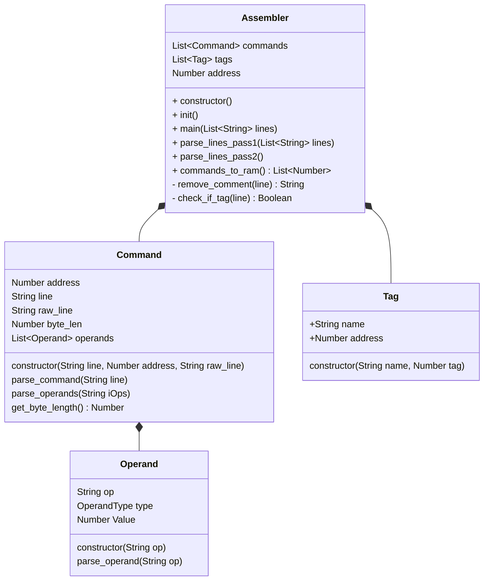

# Diagram

```mermaid

classDiagram
    Command *-- Operand
    Assembler *-- Command
    Assembler *-- Tag

    class Tag{
        +String name
        +Number address
        constructor (String name, Number tag)
    }

    class Operand{
        String op
        OperandType type
        Number Value

        constructor(String op)
        parse_operand(String op)
    }

    class Command{
        Number address
        String line
        String raw_line
        Number byte_len
        List~Operand~ operands

        constructor(String line, Number address, String raw_line)
        parse_command(String line)
        parse_operands(String iOps)
        get_byte_length() Number
    }

    class Assembler{
        List~Command~ commands
        List~Tag~ tags
        Number address

        + constructor()
        + init()
        + main(List~String~ lines)
        + parse_lines_pass1(List~String~ lines)
        + parse_lines_pass2()
        + commands_to_ram() List~Number~

        - remove_comment(line) String
        - check_if_tag(line) Boolean

    }
```
