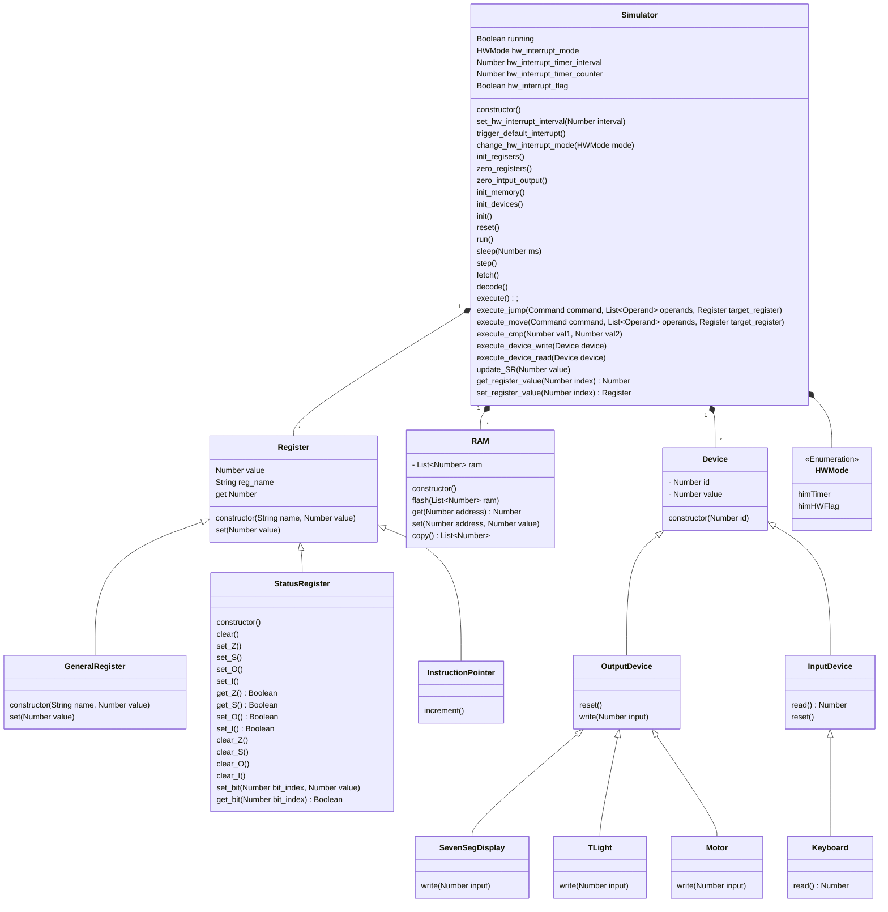

# Diagram

```mermaid
classDiagram

    Register <|-- GeneralRegister
    Register <|-- StatusRegister
    Register <|-- InstructionPointer

    class Register{
        Number value
        String reg_name

        constructor(String name, Number value)
        set(Number value)
        get Number
    }

    class GeneralRegister{
        constructor(String name, Number value)
        set(Number value)
    }

    class StatusRegister{
        constructor()
        clear()

        set_Z()
        set_S()
        set_O()
        set_I()

        get_Z() Boolean
        get_S() Boolean
        set_O() Boolean
        set_I() Boolean

        clear_Z()
        clear_S()
        clear_O()
        clear_I()

        set_bit(Number bit_index, Number value)
        get_bit(Number bit_index) Boolean
    }

    class InstructionPointer{
        increment()
    }

    class RAM{
        - List~Number~ ram

        constructor()
        flash(List~Number~ ram)
        get(Number address) Number
        set(Number address, Number value)
        copy() List~Number~
    }

    Device <|-- OutputDevice
    OutputDevice <|-- SevenSegDisplay
    OutputDevice <|-- TLight
    OutputDevice <|-- Motor

    Device <|-- InputDevice
    InputDevice <|-- Keyboard


    class Device {
        - Number id
        - Number value

        constructor(Number id)
    }

    class OutputDevice{
        reset()
        write(Number input)
    }

    class SevenSegDisplay{
        write(Number input)
    }

    class TLight{
        write(Number input)
    }

    class Motor{
        write(Number input)
    }

    class InputDevice{
        read() Number
        reset()
    }

    class Keyboard{
        read() Number
    }

    class HWMode{
    <<Enumeration>>
        himTimer
        himHWFlag
    }

    Simulator *-- HWMode
    Simulator "1" *-- "*" RAM
    Simulator "1" *-- "*" Device
    Simulator "1" *-- "*" Register

    class Simulator{
        Boolean running
        HWMode hw_interrupt_mode
        Number hw_interrupt_timer_interval
	    Number hw_interrupt_timer_counter
	    Boolean hw_interrupt_flag

        constructor()
        set_hw_interrupt_interval(Number interval)
        trigger_default_interrupt()
        change_hw_interrupt_mode(HWMode mode)
        init_regisers()
        zero_registers()
        zero_intput_output()
        init_memory()
        init_devices()
        init()
        reset()
        run()
        sleep(Number ms)
        step()

        fetch()
        decode()
        execute();
        execute_jump(Command command, List~Operand~ operands, Register target_register)
        execute_move(Command command, List~Operand~ operands, Register target_register)
        execute_cmp(Number val1, Number val2)
        execute_device_write(Device device)
        execute_device_read(Device device)
        update_SR(Number value)

        get_register_value(Number index) Number
        set_register_value(Number index) Register

    }
```
